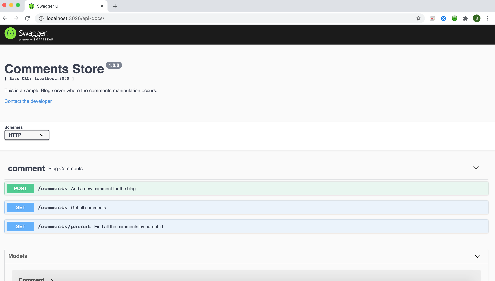

# UnsafeCloud
This is a demo app for blog site which primary focuses on comments manipulation 

WebApp Folder:
React JS application for accessing and adding comments

API :
Node.js and Express.js - API application which uses in-memory Mongo DB for comments manipulation

Deliverables:

1. API Specification : http://localhost:3000/api-docs
2. Backend code implementing the APIs : API Folder
3. Front end code for the web page that demonstrates how these APIs work : WebApp Folder
4. A Readme file that includes the steps on how to run your code. Clearly mention the dependencies, if any.
    - Refer : Setup section
5. Docker File : (API/DockerFile)

