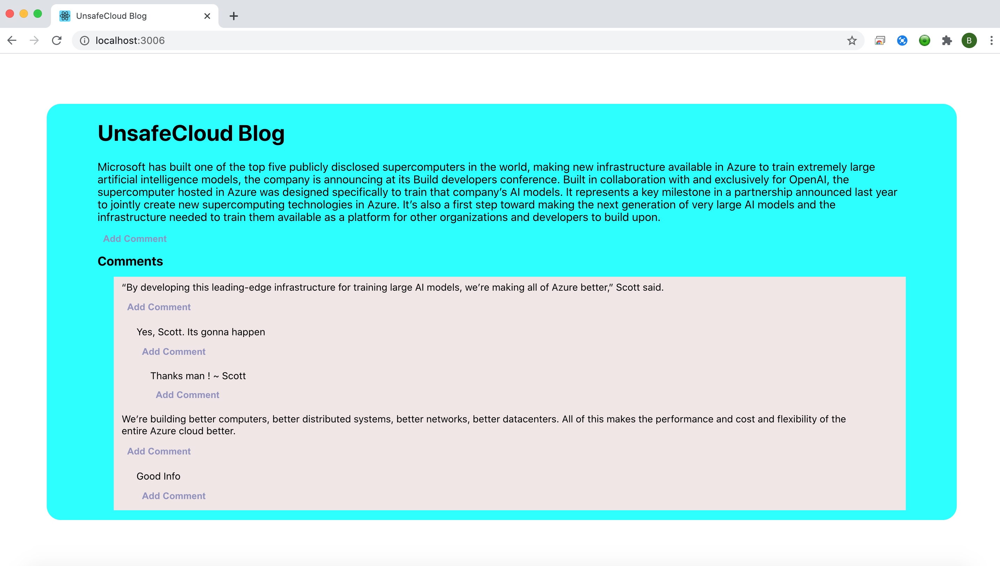

# UnsafeCloud
This is a demo app for blog site which primary focuses on comments manipulation 

## WebApp Folder

React JS application for accessing and adding comments

## API Folder

Node.js and Express.js - API application which uses in-memory Mongo DB for comments manipulation

## Dependencies
    Pre installed CLI's 
        - Git - https://git-scm.com/book/en/v2/Getting-Started-Installing-Git
        - Node.js - https://coderwall.com/p/mhd6nw/install-node-js-on-mac-os-x-and-windows
        - Docker Desktop - https://www.docker.com/products/docker-desktop

## Setup 
    
-  Clone this Git folder using terminal or command prompt "git clone https://github.com/BaluprasathSBP/UnsafeCloud.git"                
-  ##### API
    - Navigate to "API" folder in terminal/Command propmt and execute following commands
        - Execute the command "docker-compose -f docker-compose.yml up --build"
        - Execute "docker ps" in separate terminal
        - Then the output should be like in the below image,
            
            Verify the highlighted Contianer's Image and Port (scribbled)
        - Take a note of port, if not 3000
        - Browse "http://localhost:3000/" or change the port as your output from docker - to verify the 
             API Start Page: 
             API Specification Page : 

- ##### Web Application
    - Navigate to "WebApp" folder in terminal / Command prompt and execute following commands
        - If the API hosted port is 3000 in localhost, please ignore this step.
                Open "src/Constants/index.js" and change the port name which was highlighted in the above image from docker container of your output
        - Execute "npm install"
        - Execute "npm start"
        - Then Browse http://localhost:3006/ to verify,

           
    
## Deliverables:

1. API Specification : http://localhost:3000/api-docs
2. Backend code implementing the APIs : API Folder
3. Front end code for the web page that demonstrates how these APIs work : WebApp Folder
4. A Readme file that includes the steps on how to run your code. Clearly mention the dependencies, if any.
    - Refer : Setup section
5. Docker File : (API/DockerFile)